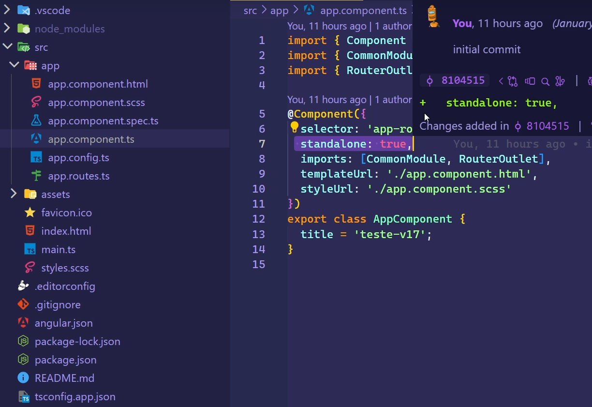
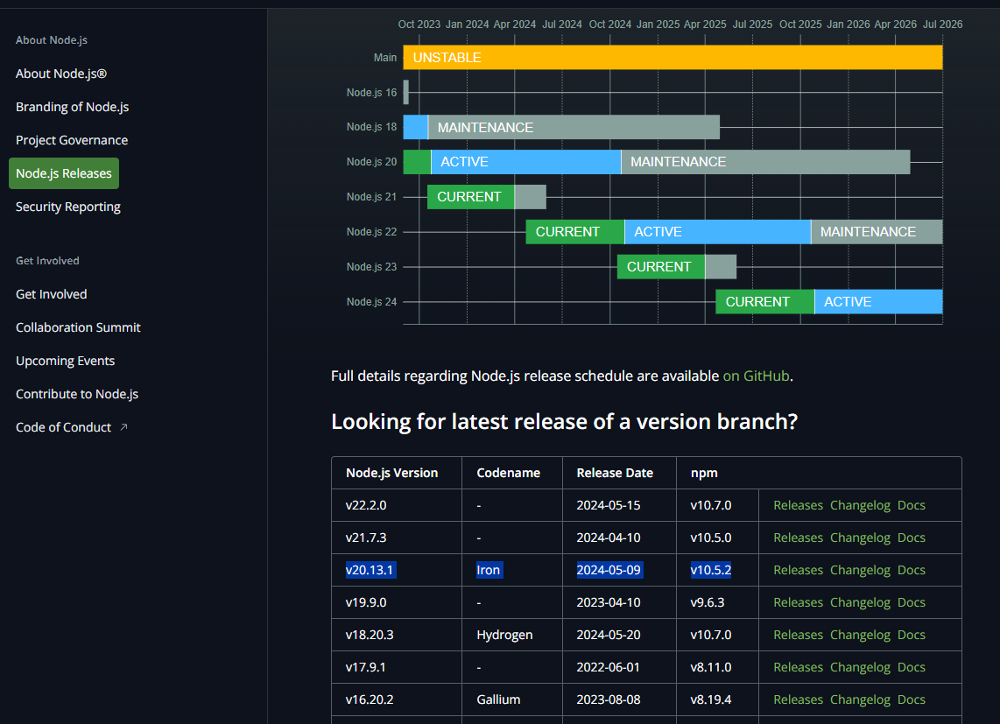
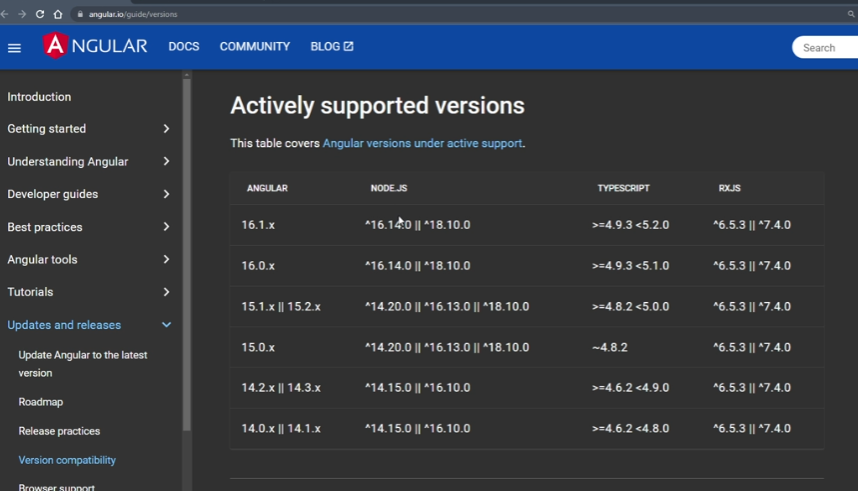
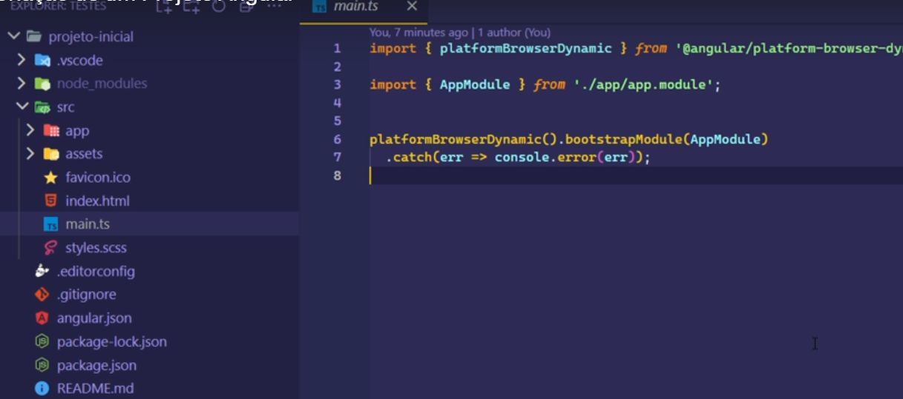
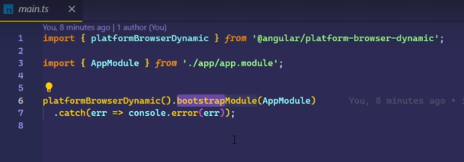
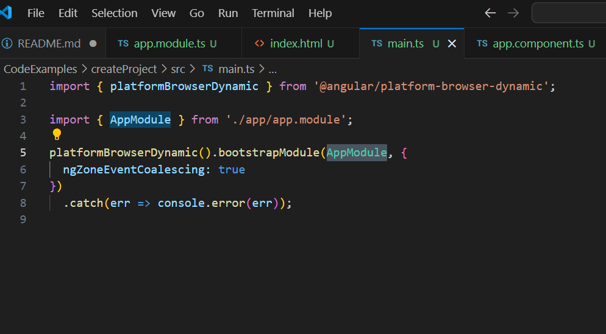
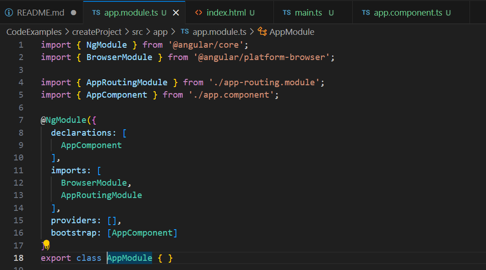
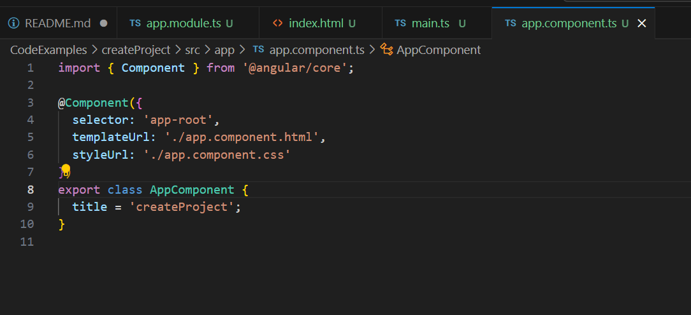
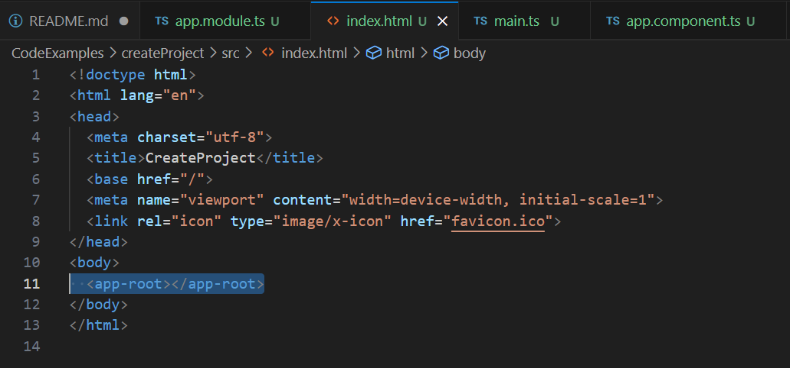

# AngularJs
Repositório para estudo do Angular JS

## Comands Notes

For to run Angular.js you needded to install node js, at the site.
After that typing this command at the terminal:
```
npm install -g @angular/cli
```
Quando geramos um novo projeto ele vem com um componente na versão stand alone. Os projetos na versão 16, não vem com a versão stand alone for default.


### 
Vai gerar um projeto com um componente na versão stand alone.
A versão não tem app module, quando se trata da versão 17.
Ele gerará o componente na versão stand alone.

```
ng new project-17
```



Com essa forma ele criará o app module, ao gerar um novo projeto.
```
ng new project --no-standalone
```


At this site you can see the previews downloads:

https://nodejs.org/en/about/previous-releases#nodejs-releases



You should verify node and angular versions:



-------

@angular/cli

Disponibiliza o comando ng para fazermos instalações.
É possível utilizar a lib. npx, e este sempre baixará a última versão do angular cli.
Porém o npx sempre vai baixar o angular cli, fazer o download do que precisa e depois remove-lo. Ou seja demora um pouco mais.

O package.json vai auxiliar no gerenciamento de pacotes do projeto.
A pasta src, é o coração do projeto.



main.ts é o arquivo que carregará todos os outros módulos e componentes da aplicação e a partir dele que será feito todo o processo de inicialização.

index.html, possuí a referência do código gerado, o angular irá injetar os scripts que foram gerados a partir do main.ts


#### Executar um projeto

```
  ng serve
```

o termo bootstrap, no angular tem referência a inicialização do projeto. A criação do ambiente que vai servir o seu projeto e toda a inicialização dele, o processo de build do seu projeto.




### Referenciando um componente:

A seguir o main.ts está renderizando o AppModule.
Para que isso seja possível é necessário a seguinte estrutura:


app.module.ts
app.component.ts
index.html (file.html) (referencia-se o selector do arquivo app.components.ts)







Os componentes são referenciados dentro do app.component.ts

É possível criar componentes por meio do comando:

```
ng generate component [nome-componente]
```
---------------


---------


- Conceitos de componentes
- Como criar componentes
- Como declarar componentes em módulos
- Como criar componentes filhos
- Como referenciar componentes de outros módulos (externos)
- Estratégias de estilização de componentes
    - Configuração de Inline Template e Inline Css
    - ::ng-deep
    - :host
- View Encapsulation
    - None
    - Emulated
    - ShadowDOM