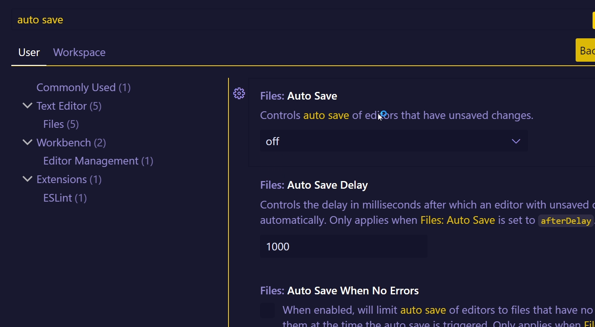
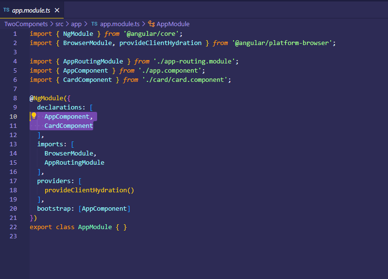

# AngularJs
Repositório para estudo do Angular JS

## Comands Notes

For to run Angular.js you needded to install node js, at the site.
After that typing this command at the terminal:
```
npm install -g @angular/cli
```
Quando geramos um novo projeto ele vem com um componente na versão stand alone. Os projetos na versão 16, não vem com a versão stand alone for default.


### 
Vai gerar um projeto com um componente na versão stand alone.
A versão não tem app module, quando se trata da versão 17.
Ele gerará o componente na versão stand alone.

```
ng new project-17
```


Com essa forma ele criará o app module, ao gerar um novo projeto.
```
ng new project --no-standalone
```


At this site you can see the previews downloads:

https://nodejs.org/en/about/previous-releases#nodejs-releases


You should verify node and angular versions:


-------

@angular/cli

Disponibiliza o comando ng para fazermos instalações.
É possível utilizar a lib. npx, e este sempre baixará a última versão do angular cli.
Porém o npx sempre vai baixar o angular cli, fazer o download do que precisa e depois remove-lo. Ou seja demora um pouco mais.

O package.json vai auxiliar no gerenciamento de pacotes do projeto.
A pasta src, é o coração do projeto.


main.ts é o arquivo que carregará todos os outros módulos e componentes da aplicação e a partir dele que será feito todo o processo de inicialização.

index.html, possuí a referência do código gerado, o angular irá injetar os scripts que foram gerados a partir do main.ts


#### Executar um projeto

```
  ng serve
```

o termo bootstrap, no angular tem referência a inicialização do projeto. A criação do ambiente que vai servir o seu projeto e toda a inicialização dele, o processo de build do seu projeto.


### Referenciando um componente:

A seguir o main.ts está renderizando o AppModule.
Para que isso seja possível é necessário a seguinte estrutura:


app.module.ts
app.component.ts
index.html (file.html) (referencia-se o selector do arquivo app.components.ts)


Os componentes são referenciados dentro do app.component.ts

É possível criar componentes por meio do comando:

```
ng generate component [nome-componente]
```
---------------




---------


- Conceitos de componentes

O que é um componente e o que é um módulo?
    Componente é um código (layout) que pode ser utilizado em vários locais.
    Dentro do componente teremos uma lógica específica. Pode ser uma lógica de manipulação de dados ou uma lógica para mostrar os dados que o componente recebe.
    Podemos criar componentes para isolar um layout ou lógica específica.
    É importante definir quais componentes devemos ter antes de iniciar o projeto. Pois com isso conseguimos um código organizado, estruturado e pouco acoplado.
    O que é um módulo?
    
    Não podemos misturar gêneros.
    Basicamente um módulo é para organizar componetes com lógicas similares que são utilizados em locais parecidos ou na mesma tela, podemos criar um módulo para aquela tela.
    
    Na imagem acima, podemos criar um módulo de declarar estes componentes no módulo da primeira tela.
    Agora podemos também criar um módulo para a segunda tela e separar todos os componentes criados na segunda tela.
    
    No Angular existe uma regra que só podemos declarar um componente com apenas 1 módulo. Não podemos ter um componente x declarado no módulo da página 1 e declarado no módulo da página 2. Para usarmos nas duas páginas devemos exportar o componente. 
    ####### E quando formos usar o componente, importaremos na página o módulo. Modulos sempre importamos.
    

-------
- Como criar componentes
- Como declarar componentes em módulos
- Como criar componentes filhos
- Como referenciar componentes de outros módulos (externos)
- Estratégias de estilização de componentes
    - Configuração de Inline Template e Inline Css
    - ::ng-deep
    - :host
- View Encapsulation
    - None
    - Emulated
    - ShadowDOM

------
app.component é a primeira classe a ser executada


o primeiro modulo a ser executado, é o app.module.


Ele executa o app.module e faz o bootstrap no primeiro componente.

## Criando componentes

```
ng g c card
```

O arquivo card.component.spec.ts, pode ser criado testes.


card.component.spec.ts é um exemplo de uma classe de teste

card.component.scss é o arquivo de estilo

card.component.ts é a classe do componente (classe js)


Todo componente será uma classe e terá esse padrão.


Para definirmos que uma classe será um componente usamos um decorator
@Component

selector é o nome do component quando referenciamos ele no html

<app-card></app-card>

template url, ele aponta o componente html (o template do componente), html carregado ao referenciar dentro de algum componente

stylesUrl, é o componente de arquivo que será carregado no estilo do componente

O módulo principal da aplicação possui alguns parâmetros específicos.

app-module


##### Declaretions
É aonde declaramos nosso componente.
Sempre que referenciamos um componente em um módulo estamos declarando ele.

Componentes sempre vem dentro do array do declarations.


Ao executar a linha de comando do arquivo, nós temos um update da classe app.module, que basicamente referencia o componente novo na classe principal.



##### Imports

Caso desejamos importar dentro do nosso componente uma funcionalidade de outro módulo usamos os array de imports.


E ficamos com essa estrutura.